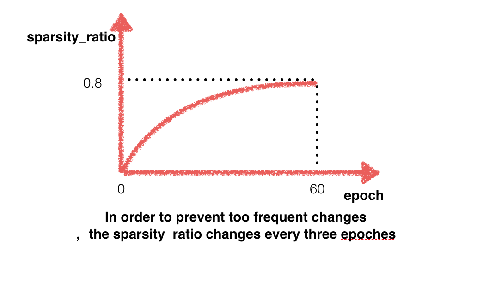

### new add layer:
- `compress_conv_layer`
- `compress_inner_product_layer`

### Usage:

```
#compress convolution layer
layer {
  name: "conv2"
  type: "CConvolution"  #compress convolution type
  bottom: "pool1"
  top: "conv2"
  param {
    lr_mult: 1
  }
  param {
    lr_mult: 2
  }
  convolution_param {
    num_output: 50
    kernel_size: 5
    stride: 1
    weight_filler {
      type: "xavier"
    }
    bias_filler {
      type: "constant"
    }
  }
 cconvolution_param{
   upper_bound: 0.94 #最终达到的稀疏度
   iter_stop: 30000  #到达iter_stop后，不再进行压缩，一般为inter_iter的20倍
   inter_iter: 1500  #每inter_iter 进行一次稀疏变化，一般这个数为3个epoch包含的iter数
 }
}

# compress fc layer
layer {
  name: "ip2"
  type: "CInnerProduct"
  bottom: "ip1"
  top: "ip2"
  param {
    lr_mult: 1
  }
  param {
    lr_mult: 2
  }
  inner_product_param {
    num_output: 10
    weight_filler {
      type: "xavier"
    }
    bias_filler {
      type: "constant"
    }
  }
 cinner_product_param{
   iter_stop: 30000
   upper_bound: 0.97
   inter_iter: 1500
 }
}

```
### Process of sparsity changes

整个fine-tune过程，稀疏变化次数为  `iter_stop / inter_iter`，每过`inter_iter` 变化一次. 正如上图所示，变化过程为一个log曲线，到训练后期重要参数很多， 一次性prune掉较多参数会导致accuracy严重下降， 因而前期稀疏度上升比较大，越到后期上升幅度小。


## Examples
### lenet
`./examples/mnist/train_pruning.sh`


### Vgg-s
```
cd models/caffe-oxford102
./boostrap.py   # download data of oxford flowers 102
sh train.sh  # remember to modity the data_dir in *.prototxt
```

### Mobilenet
oxford 所有1*1 卷积压缩可达到71% 精度损失在0.05内
```
cd models/oxford
./train_mobilenet.sh  #train the mobilenet 
./train_pruning.sh    # pruning a pre-trained models

```
